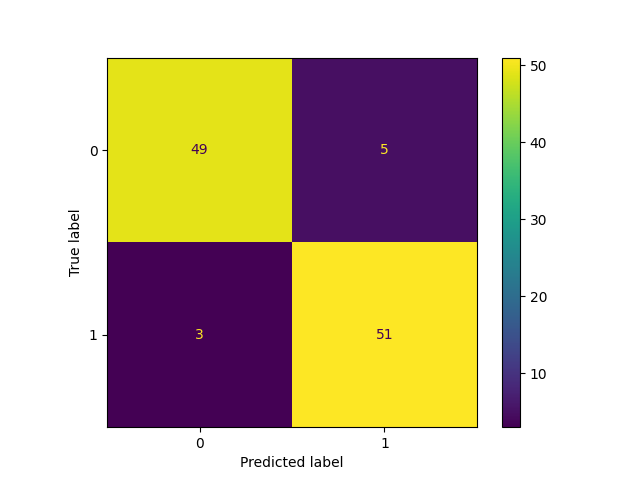

# Blur Classification

A machine learning project for detecting and classifying blurred images, specifically designed for face recognition preprocessing. This tool helps determine whether an image is blurred or not blurred, which is crucial for maintaining quality in face recognition systems.

## Features

- Blur detection using Local Binary Patterns (LBP)
- Support Vector Machine (SVM) classification
- High accuracy (>92%) in blur detection
- Optimized bin parameters for LBP feature extraction
- Saved model support for quick deployment

## Prerequisites

- Python 3.x
- OpenCV
- scikit-learn
- scikit-image

## Installation

Install the required dependencies using pip:

```bash
pip3 install opencv-python
pip3 install opencv-contrib-python
pip3 install -U scikit-learn
pip3 install -U scikit-image
```

## Project Structure

```
blur-classification/
├── dataset/                # Training and testing dataset
├── model_saved/           # Directory for saved models
├── training.py            # Training script
├── utils.py              # Utility functions
└── README.md
```

## Usage

1. Prepare your dataset:
   - Organize your images in the `dataset` directory
   - Images should be separated into blur and non-blur categories

2. Train the model:
```bash
python training.py
```
The script will:
- Load the dataset using the utility functions
- Train a Linear SVM classifier
- Test different LBP bin parameters (24-32)
- Save the best performing model (accuracy > 92%)

3. The best model will be saved in the `model_saved` directory with the naming format:
```
best_model_LBP_bin-{bin_number}_acc-{accuracy}.pickle
```

## Model Performance

The current model achieves over 92% accuracy on the test set using Linear SVM classification with the following parameters:
- C = 250 (SVM parameter)
- LBP binning optimized between 24-32 bins
- Best performing model parameters are saved automatically



## Contributing

Pull requests are welcome. For major changes, please open an issue first to discuss what you would like to change.

Please make sure to update tests as appropriate.

## License

This project is licensed under the [MIT License](https://choosealicense.com/licenses/mit/) - see the LICENSE file for details.
